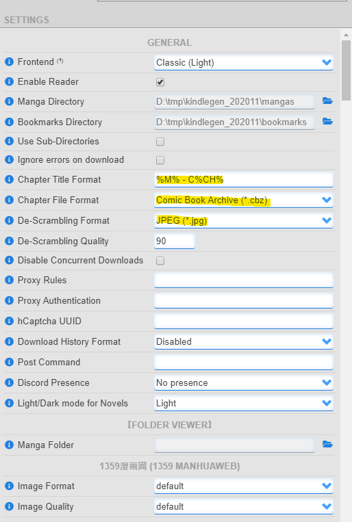

## Requirements
- [Hakuneko](https://hakuneko.download/) — for downloading manga chapters in a CBZ format
- [CBZ Combiner](https://github.com/k-nacion/cbz-combiner) — for combining multiple CBZ
- [KCC Plugin](https://github.com/ciromattia/kcc?tab=readme-ov-file#prerequisites) — for converting CBZ file to MOBI format. 
- [Calibre](https://calibre-ebook.com/download) — for uploading the MOBI files (the manga(s)) to your E-Reader device.
---
## Configurations
### Hakuneko

These settings in Hakuneko are all **optional**. You can configure your own settings. 
**However**, in order for the CBZ Combiner to work,  the *Chapter File Format* must be set to *Comic Book Archive (*.cbz)*.

---

## Procedure
### Downloading Manga from Hakuneko
1. Go to your manga website of your choosing (mangadex.org, mangafire.to, etc.). I am using Mangakatana.com for example. 
2. Find a manga there that you want to download. 
   For example: this is the manga that I want to download: [Jigokuraku (KAKU Yuuji)](https://mangakatana.com/manga/jigokuraku-kaku-yuuji.19894).
   Copy the URL link of the manga. 
3. Open up the Hakuneko. 
4. Click here:
   ![[Hakuneko 1.png]]
5. Click the Clipboard
   ![[Hakuneko 2.png]]
6. Press the refresh button to load the link in the clipboard
   ![[Hakuneko 3.png]]
7. **Explanations**:
   - **Click the manga:** this will load the chapters on the right side pane. 
   - **Click the download button:** this will download all the chapters loaded in the right side pane. You also have the option to download the chapters selectively by clicking the cloud button on the chapters. 
   - **Click to show download progress:** Basically what it means. 
   - **Bookmark the manga:** so you have an easy access on the manga later on instead of just doing all the steps all over again.  
   ![[Hakuneko 4.png]]

All the downloaded files are stored in the directory where you configured this. 

### Combining the CBZ files
As you can see, there is a lot of CBZ files that was generated. And if you want to combine them for reading seamlessly, we can combine this with CBZ Combiner. 

1. Open the CBZ Combiner. 
2. Copy the directory of the manga that contains the CBZ files.
3. CBZ Combiner will ask for the maximum file size to be generated.
   Why? because the KCC plugin is only capable of maximum ~300 mb and cannot process more than that. I usually go for 250 MB limit.  
4. This will generate a directory relative to the CBZ Combiner current directory. It will generate **output/[manga_name]_[index].cbz**. depending on how many output files will be generated. 
5. Now that you have a combined CBZ files, we can proceed to convert the CBZ file to MOBI format. 

### Converting CBZ to MOBI
Note: the configuration are just a suggestion for the KCC. You can absolutely modify the configurations that was set here to your liking. 

**Requirement**:
- File format must be a MOBI./AZW3 to produce a MOBI format. 

1. Open up the KCC plugin. 
   ![[KCC 1.png]]
2. Drag and drop the CBZ files that was generated to this KCC app. 
   ![[KCC 2.png]]
3. Press the **Convert** button. 
4. Once completed, we can upload these MOBI generated file to your E-Reader device. 

### Uploading MOBI to E-Reader device. 
1. Open up Calibre.
2. Drag and drop the MOBI files to the Calibre app. 
3. Connect your E-Reader device to your computer via USB. 
![[Calibre 1.png]]
4. Highlight the books that you wanted to send. 
5. Press the "Send to device". 
6. That's it! You can now read the books/manga in your E-reader device. 